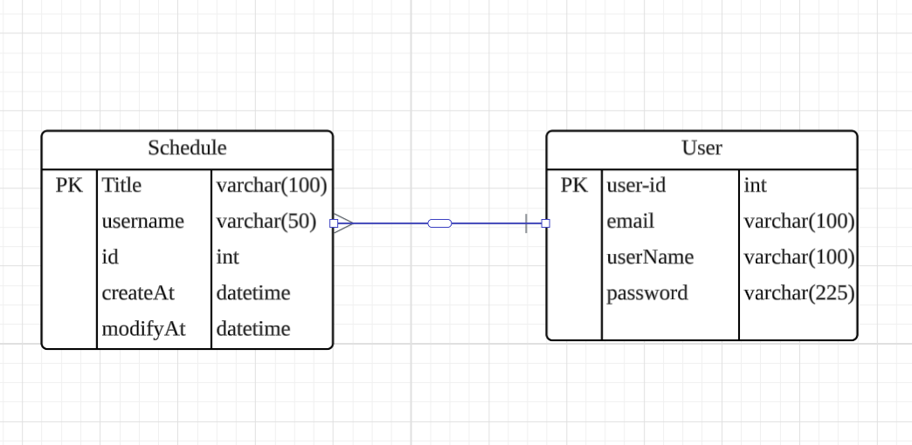

Notion:https://www.notion.so/API-1c11c01cda718079a904d6c0523f3647
#  Schedule-Project

## API 명세서
| 기능       | method | URL                           | Request  | Response | 상태 코드     |
|----------|--------|-------------------------------|----------|----------|-----------|
| 일정 생성    | POST   | /api/schedules                | 요청 body  | 등록 정보    | 200:정상 등록 |
| 일정  조회   | GET    | /api/schedules/{scheduleId}   | 요청 param | 다건 응답 정보 | 200:정상 조회 |
| 일정 목록 조회 | GET    | /api/schedules                | 요청 param | 단건 응답 정보 | 200:정상 조회 |
| 일정 수정    | PUT    | /api/schedules/{scheduleID}   | 요청 body  | 수정 정보    | 200:정상 수정 |
| 일정 삭제    | DELETE | /api/schedules/{scheduleId}   | 요청 param | 삭제 정보    | 200:정상 삭제 |

# ERD

